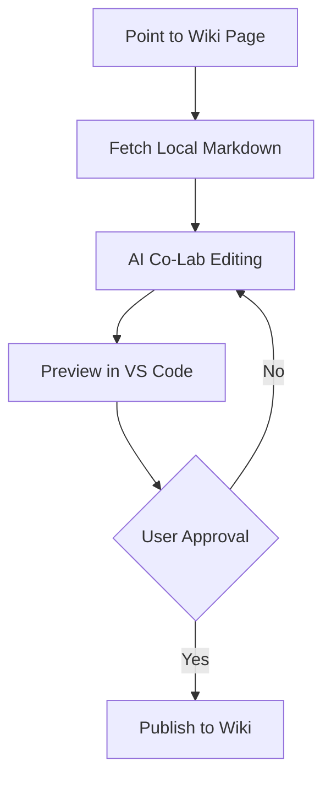

## 🕷️ Hackteria WikiBot (Arai-eek)

An experimental, Python-based toolkit for local-first wiki management. This project focuses on bridging local Markdown drafting with the [Hackteria Wiki](https://hackteria.org/wiki/).

## 🚀 Status: ALPHA / USABLE
This toolkit has evolved through rigorous "Bio-Feral" prototyping. 
- **Image Uploads**: Successfully automated with "Timeout-then-Check" logic.
- **Conversion Logic**: Robust Markdown-to-Wiki translation via `pandoc` + regex patches.
- **Learnings**: See [LEARNINGS.md](LEARNINGS.md) for a deep dive into the technical insights gained during development.

## 🏔️ Active Prototypes & Demos
- **[[Cyber-Tropicality]]**: A visionary page co-created by human and AI. [Live Page](https://hackteria.org/wiki/Cyber-Tropicality)
- **[[OpenScienceLab]]**: Currently undergoing section-level refinement. [Live Page](https://hackteria.org/wiki/OpenScienceLab)

## 🤝 AI Co-Lab Editing Workflow
The bot enables a collaborative "Fetch-Edit-Push" loop:

> [!IMPORTANT]
> **Human-in-the-Loop**: The bot is programmed to never push changes without explicit user approval for each specific edit. This ensures safety and quality control.

1. **Fetch**: Use `make fetch-page PAGE="..."` to get a local Markdown draft.
2. **Explore**: Use `make explore PAGE="..."` to find the section index.
3. **Co-Lab**: Edit the file in `workspace/drafts/`.
4. **Publish**: Use `make post-draft DRAFT="..." PAGE="..."` to push back.

## 🏗️ Project Structure
- `wiki_engine/`: The core automation logic (the "Brain").
- `tools/`: CLI entry points for humans (`fetch`, `publish`, `explore`).
- `workspace/`: Your collaborative space.
    - `drafts/`: Local staging area for `.md` and `.wiki` files.
    - `media/`: Images and assets for upload.
- `docs/`: Institutional memory.
    - `SKILL.md`: Behavioral rules for AI coding assistants.
    - `LEARNINGS.md`: Technical insights and breakthroughs.
- `Makefile`: Quick command-line shortcuts.

## 🚀 Getting Started
1. **Install Dependencies**: `pip install -r requirements.txt` and ensure `pandoc` is installed on your system.
2. **Configure**: Fill in your credentials in `.env`.
3. **Draft**: Create a Markdown file in `workspace/drafts/`.
4. **Publish**: `make post-draft DRAFT=your_page.md PAGE="Wiki Page Title"`

---
*Developed during the Technobiological Futures Co-Laboratories 2026.*
