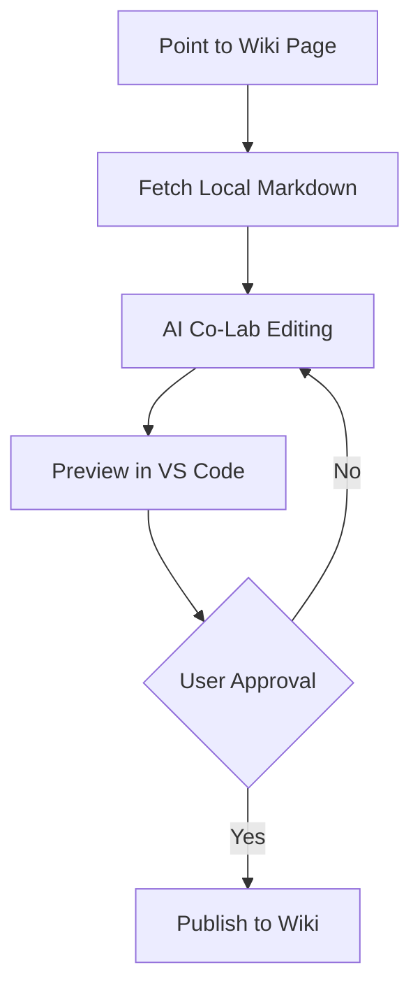

# 🧠 AI Skill: Hackteria WikiBot Management

This project is a toolkit for automating the [Hackteria Wiki](https://hackteria.org/wiki/). Use this guide to understand how to interact with the bot and the wiki.

## 🏗️ Project Architecture

- **Package**: `wiki_engine`
- **Configuration**: `.env` (contains `BOT_USERNAME`, `BOT_PASSWORD`, `WIKI_URL`)
- **Core Modules**:
    - `wiki_engine.connection`: Handles `connect()` and `get_site_stats()`.
    - `wiki_engine.editor`: Handles `save_page()` and `append_to_page()` with interactive CAPTCHA support.
    - `wiki_engine.config`: Loads settings and handles paths.
    - `wiki_engine.drafter`: Manages local `.md` and `.wiki` drafts.
    - `wiki_engine.converter`: Converts Markdown to MediaWiki using Pandoc.
    - `wiki_engine.images`: Handles image uploads and downloads.

## 🛠️ Key Coding Patterns

### 1. Connecting to the Wiki
Always use the `connect` helper. It handles logging in and verification.
```python
from wiki_engine import connect
site = connect(login=True)
```

### 2. Editing Pages
Use `save_page` for all edits. It includes built-in retry logic for CAPTCHAs.
```python
from wiki_engine import save_page
save_page(site, "Page Title", "New content here", summary="Edit description")
```

### 3. Appending Content
Use `append_to_page` to add logs or updates to the bottom of a page.
```python
from wiki_engine import append_to_page
append_to_page(site, "Log Page", "New log entry", summary="Adding logs")
```

## 🚀 Common Commands

| Task | Command |
| :--- | :--- |
| Test Connection | `make test` |
| Explore Sections | `make explore PAGE="Title"` |
| Fetch Page | `make fetch-page PAGE="Title"` |
| Fetch Section | `python3 -m wiki_engine.fetch_page "Title" --section N` |
| View Draft | `make view-draft DRAFT=name.md` |
| Post Draft | `make post-draft DRAFT=name.md PAGE="Title"` |
| Post Section | `python3 -m wiki_engine.post_draft draft.md "Title" --section N` |
| Upload Image | `make upload-img IMG=path FILE=name.png` |

## 🤖 AI Workflow Strategy (Local-First)



When asked to "Modify an existing page" or "Update a section":
1. **Fetch Existing**: Use `make fetch-page PAGE="Title"` or the `--section` flag to get current content.
2. **Draft Locally**: Edit the content in the `drafts/` directory.
3. **Review & Edit**: Inform the user that the draft is ready for manual review/edit in the `drafts/` folder.

### 🖼️ Image Upload Strategy (Ghost Success)
- **Problem**: API uploads often hang but succeed on the server.
- **Rule**: If an upload times out or throws a connection error, **DO NOT** assume failure.
- **Rule**: Immediately check `Special:Log/upload` or query image existence via API.
- **Rule**: Wait at least 5-10 seconds before checking to allow server processing to settle.

### 🔗 Link & Navigation Strategy
- **Rule**: Favor Markdown-style links `[Title](Wiki_Slug)` in local drafts.
- **Benefit**: This allows clickable previews in the local editor while ensuring `pandoc` converts them to native `[[Wiki_Slug|Title]]` upon posting.
- **Rule**: Only use `[[Wiki Link]]` directly if no specific title/alias is needed.

### 💂 Human-in-the-Loop (MANDATORY)
- **Rule**: Never `push` or `post` a draft without the user's explicit approval of the *final text*.
- **Rule**: Provide a clear "Diff" or summary of changes before asking for approval.
5. **Mandatory Approval**: NEVER push to the wiki without an explicit "Push", "Publish", or "Ok to upload" command from the user for the *current* set of changes. Do not assume previous approvals apply to new edits.
6. **No Red Links**: Always verify the existence of internal wiki pages via `site.api('query', titles='...')` before creating a link. Do NOT create "wanted pages" unless specifically asked.
7. **Efficient Research**: Prefer using `wiki_engine` API calls, `search_web`, or `read_url_content` over the visual browser subagent for verifying wiki structure and content.
8. **Mandatory Attribution**: All AI-assisted content must include a standard disclaimer at the bottom of the section/page, including the models used:
   `----`
   `''This content was drafted with the assistance of an AI agent (Arai-eek Bot using Gemini 2.0 Flash and DeepSeek V4 Pro). Please review and verify all information.''`
9. **Publish**: Only after approval, use `python3 -m wiki_engine.post_draft` to upload the finalized content.
10. **Solve**: Handle interactive CAPTCHAs during the publish phase.

## 🖼️ Universal Image & Link Strategy

To maintain a "Local-First" workflow with working previews and clean wiki-code:

1. **Images**: Always use standard Markdown syntax in `.md` files:
   ``
   * This ensures images are visible in local Markdown editors.
2. **Links**: Use Markdown link syntax for internal wiki pages:
   `[Display Text](Wiki_Page_Title)`
   * **Why**: This keeps the local Markdown preview clickable and clean.
   * **Result**: Pandoc automatically converts these to `[[Wiki_Page_Title|Display Text]]` for the wiki.
   * **Verification**: You MUST verify the `Wiki_Page_Title` exists (via API or search) to avoid creating "wanted pages" (red links).
3. **External Links**: Use standard Markdown for external URLs: `[Text](https://...)`.
4. **Consistency**: Avoid using MediaWiki tags (`[[...]]` or `[[File:...]]`) directly in Markdown drafts if a Markdown equivalent exists, as it preserves local preview functionality.

## 🧠 Advanced Tips & Lessons Learned

- **Image Optimization**: Always resize images to a maximum width of 1024px and compress them (quality ~85%) before upload. The `wiki_engine.images.optimize_image()` utility handles this automatically.
- **CAPTCHA Persistence**: MediaWiki captchas (like "What year was Hackteria founded?") change frequently. The bot is equipped to prompt for these interactively.
- **Pandoc Dependency**: The conversion workflow requires `pandoc` to be installed on the host system.
- **Wiki Structure**: Always try to link to existing pages like `[[Technobiological Futures Co-Laboratories]]` to maintain the wiki's connective tissue.

---
*This file helps AI coding assistants (Antigravity, Cursor, etc.) understand the project context.*
